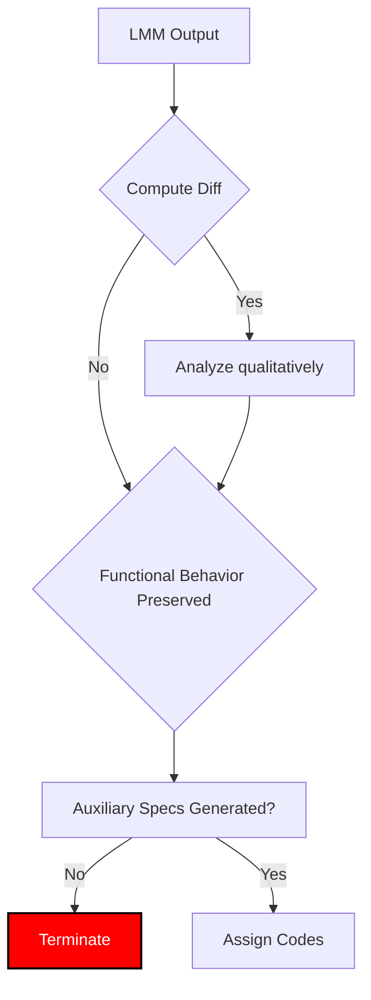

```mermaid
flowchart TD
    A[LMM Output] -->B{Compute Diff}
    B -->|Yes| C[Analyze qualitatively]
    B -->|No| D{Functional Behavior Preserved}
    C --> D
    D --> E[Auxiliary Specs Generated?]
    E --> |No| T[Terminate]
    E -->|Yes| F[Assign Codes]

style T fill:#FF0000,stroke:#000,stroke-width:2px,color:white
```
