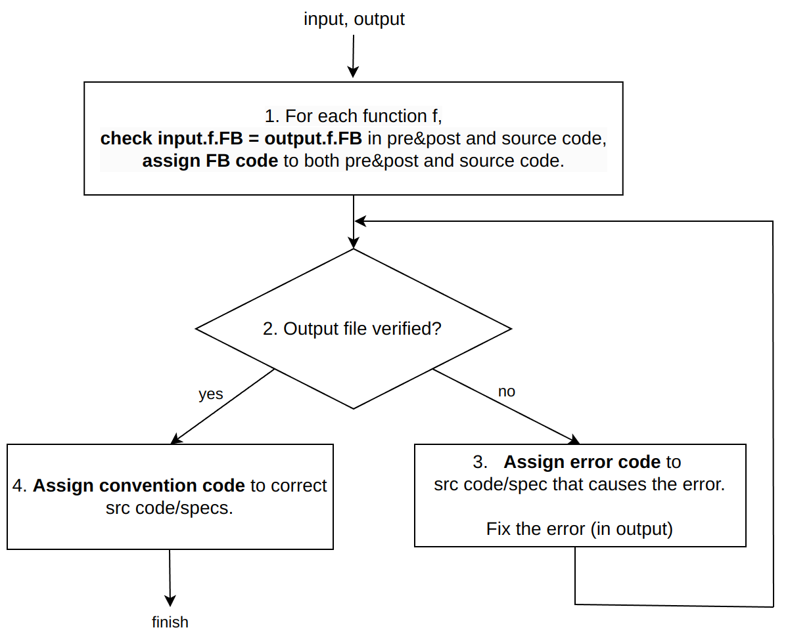

The procedure of qualitative analysis

# Workflow

To perform qualitative analysis, we first analyze if the functional behavior (FB) of the original C code is preserved in precondition&postcondition and source code for each file; Then, we iteratively categorize the errors and fix them in the output file; Finally, we analyze the conventionality of the source code and the correctly generated specifications.

# Coding

Definition of Coding, includes the coding for functional behavior preservation, errors and convention.

## Functional Behavior Preservation

To represent the ability of GPT-4o to preserve the functional behavior, we assign codes to two main components in the generated output file: Precondition&postcondition and source code.

Here we show the coding for Precondition&postcondition, and the one for source code is similar.

- Preserved: For all functions, the precondition&postcondition in the output file that specify the intented behavior of function are equivalent to the corresponding parts (i.e., precondition&postcondition or natural language comment that specify the intented behavior) in the input.
- (only) Strengthened: (Other than the case of preserved) There exists some function, the precondition&postcondition in the output file that specify the intented behavior of function imply the corresponding parts in the input.
- (only) Weakened: (Other than the case of preserved and strengthened) There exists some function, the precondition&postcondition in the output file that specify the intented behavior of function are implied by the corresponding parts in the input.
- Other cases: The rest of cases

## Error code

We divide the errors based on their relevance to the process of proving a program's correctness against a specification. Specifically, they are divided into compilation errors (unrelated to formal verification process) and verification errors (related to proving).

### Compilation Error

These errors represent "parse errors" in VeriFast, which are basically errors that arise when the VeriFast tool is unable interpret the code. This could be due to syntax issues, such as missing semicolons, incorrect brackets, invalid keywords, or other structural errors that prevent verification. To better represent the compilation errors, we have the following subcodes:

- Specification out-of-position: This subcode represents situations where the specifications are not present at the correct location and are misplaced within the output file, resulting in parse error. Common cases are the precondition, postcondition or loop invariant is not at the right position.
- Syntax error: the error happens during the parsing stage.
- Include or Type Check error: This subcode represents errors that arise due to GPT hallucinating variables, predicates or function calls, due to which VeriFast fails in the include or type check stage. This error commonly happens during the include stage or type check stage.

### Verification Error

These errors arise during the formal verification phase and are directly related to proving that the program meets its specified requirements. Based on the type of specification (e.g., precondition, postcondition, ...) that the fix is on, the errors include:

- Incorrect precondition/postcondition
- Incorrect predicate definition
- Incorrect predicate usage: e.g., adding/deleting/changing open/close/assert/leak statement of predicate in function body.
- Incorrect lemma definition
- Incorrect lemma usage: e.g., adding/deleting/changing lemma in function body
- Incorrect loop invariant: the content of loop invariant is modified to fix the error.
- Others: including the case where source code is modified or the built-in statement (e.g., open_struct) is added.

## Convention code

After rectifying the errors in the output file, such that it gets verified by VeriFast successfully, we then inspect the unmodified specifications and the source code in the output file to see whether they follow a good convention. The codes that we used are:

- Redundant: the condition in the spec, after being removed, doesn't affect the verification. 
- Ambiguous: the specification's name doesn't show the specification's intention.

# Analysis

The data analysis is stored in `qualitative_analysis.xlsx`, where the data and analysis of each benchmark are stored in each subsheet with the name (e.g., `enums_weak`), and the aggregated result is stored in subsheet `statistics` and `final_table`. Moreover, the raw result of feature analysis of each output file is stored in subsheet `benchmarks_feature`.

